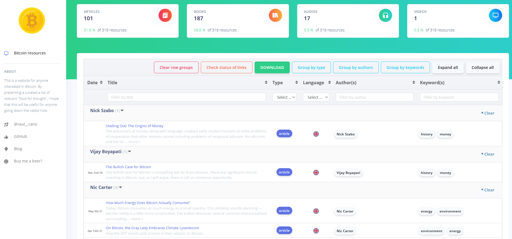

# Bitcoin Minds | The most comprehensive list of Bitcoin resources

The purpose of [BitcoinMinds.org](https://bitcoinminds.org) is to store:
- A [single CSV](/bitcoinminds-ui/public/bitcoin-resources.csv) file with a curated collection of resources to study and learn from Bitcoin (e.g. articles, books, podcasts, etc.).
- The code of a simple Bootstrap Vue interface to load and present the resources from the CSV file.



## Installing the User Interface
Go to a folder of your choice and clone this repository:
```
git clone https://github.com/raulcano/bitcoinminds.git
```

CD into the folder ```bitcoinminds-ui``` and install the packages:
```
npm install
```
Once the install is finished, start the server and visit in your browser the enabled local URL:
```
npm run serve
```

## CSV file format

The following fields and formats are the ones to be used in the file.
The first row of the CSV file will be the name of the column (each field).

### id
A unique incremental integer acting as the primary key

### date
A string of the format YYYY-MM-DD

### title
A string with the title of the resource.

### type
One of the following values:
- ```article```
- ```book```
- ```audio``` : Individual audio file or podcast episode (e.g. link to a Spotify podcast episode). 
- ```video``` : Individual video file or podcast episode in the form of video (e.g. link to a Youtube video). 
- ```podcast``` : Link to the homepage of a podcast (not to individual episodes). For the moment, we include here both audio and video podcasts (e.g. Youtube channels).
- ```course```
- ```tool```
- ```collection``` : This refers to a place that collects a variety of links to resources, which can be of many sorts (articles, books, videos, etc.).
- ```guide``` : Any resource whose goal is to guide you through some process, such as setting up your node, creating a wallet, etc. 
- ```other```

### link
A valid URL to the resource.

### language
A two-letter code of the language in which this resource is presented. If one resource (e.g. one article) is translated to several languages, this must be included in the file with one line per language.

### author
The name of the author(s). 
It can be empty if its unknown.
If there are multiple authors, they shall be separated by a comma.

### keywords
A comma separated list of keywords reflecting the main topics discussed in the resource.
Some suggested keywords are:
- wallets, economics, history, security, lightning, scaling, etc.

### description
A long text describing the content that is presented. E.g. the summary of a book.

### other
Other metadata in the form of a JSON dictionary, that is, containig a set of key-value pairs. For example:
```
{ key1: "value1", key2: "value2" }
```
